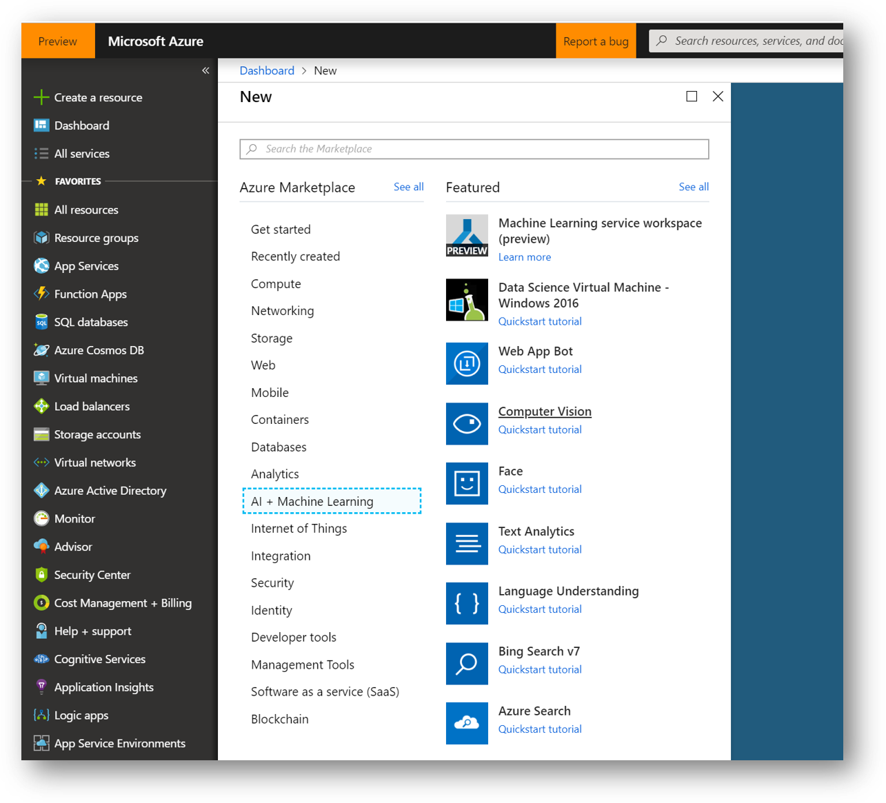
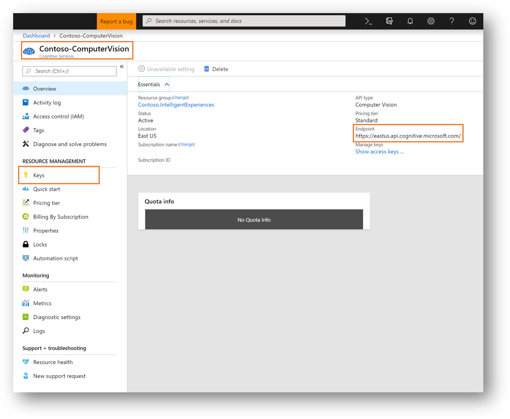

# Optical Character Recognition

Part of the Shop Manager App sign-in experience is the Employee ID scan. In order to be able to read the information on the card (like name, job title and employee id) we need to leverage an OCR service.

Azure Cognitive Service for OCR detects text in an image using optical character recognition (OCR) and extract the recognized words into a machine-readable character stream. It saves time and effort by taking photos of text instead of inputting it to the mobile by keyboard.

Further details about [extracting text with OCR](https://docs.microsoft.com/en-us/azure/cognitive-services/computer-vision/concept-extracting-text-ocr) can be found here.

# Digital ID Authentication

In order to provide a Multi-Factor-Authentication as part of the biometric sign in in the Shop Manager App, we need to send the captured employee id image to Azure OCR service to extract texts.

This is done also through the [Cognitive Pipeline](WalkthroughGuide\02-ArchitectureOptions) we discussed in the [Architecture Options](WalkthroughGuide/02-ArchitectureOptions)

# Backend Setup

To leverage the OCR service, we need to provision Azure Computer Vision service to get the needed subscription keys that will be used in our backend services.

Click create and configure the service with the required information.

Once the service is provisioned, notice the following important information:

1. Endpoint (is different depending on the region you selected)
2. Keys (access to keys needed to access the service)

The endpoint and key must be updated in the Cognitive Pipeline backend service.

## Take Picture of ID

For the demo purposes, we allowed the user to provide the ID image either using the camera or picking up a photo from the device gallery.

> **NOTE** In production, you should only allow usage of live camera to take picture of the employee ID.

You can find a sample of [Contoso ID here](Dataset/TestImages/mosaif_id.png). Feel free to use the magic of photo shopping the image with your details :)

## Send ID to OCR

ID image will be sent to back end via the .NET Core APIs. The API will save the image file to Azure Storage, update Cosmos DB with the request of a Smart Doc processing and send this to NewReq Azure Function for processing synchronously.

Function will return the text content of the ID card and it will be the responsibility of the backend API to extract the relevant information from the text.

As IDs are fixed document (Text will always be positioned in the same order in every card), we assume that the name will come in a specific order in the OCR json payload.

We parse the OCR json payload and extract the name and employee ID to compare it to the information from CosmosDB.

Upon successful match between the extracted text and the database records, results will be sent back to the caller with the details.