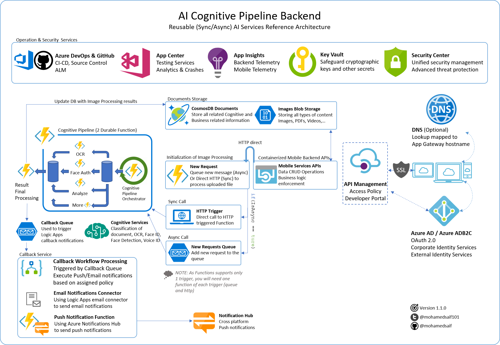
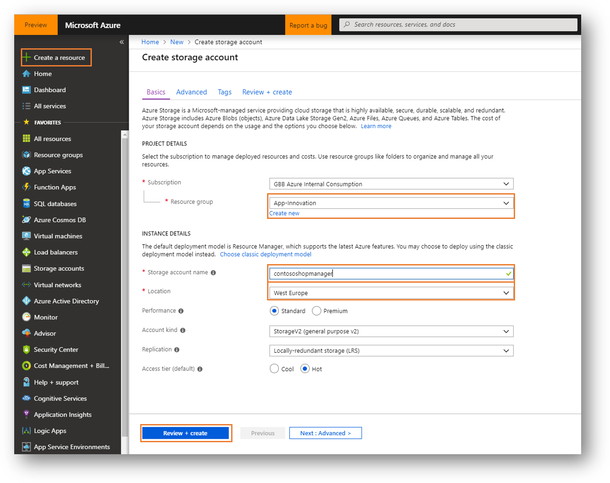
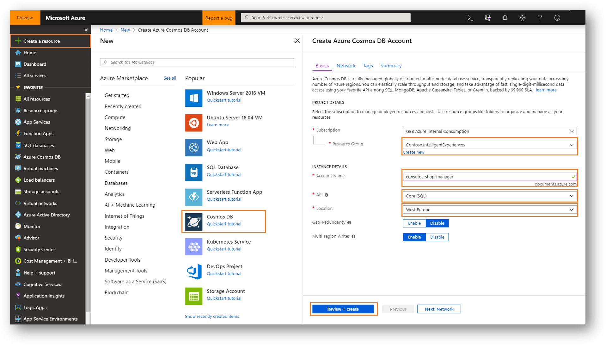
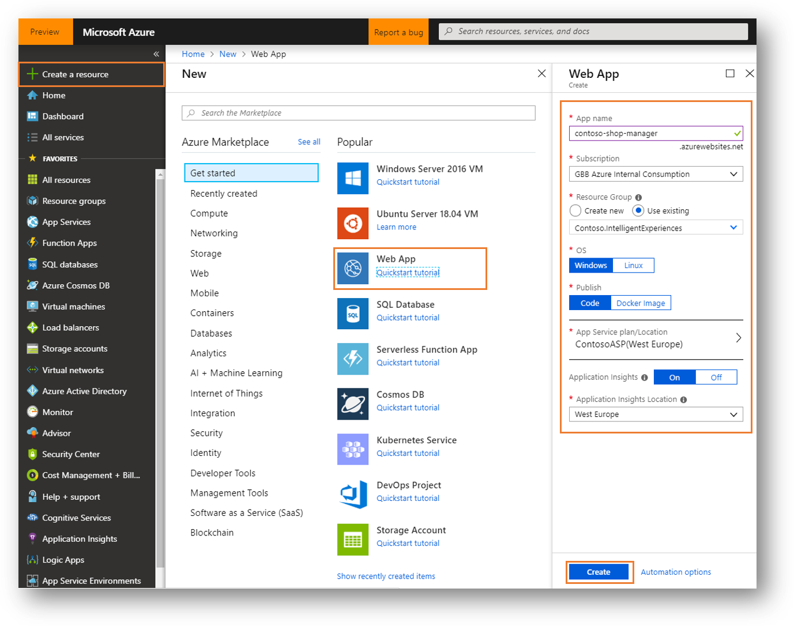
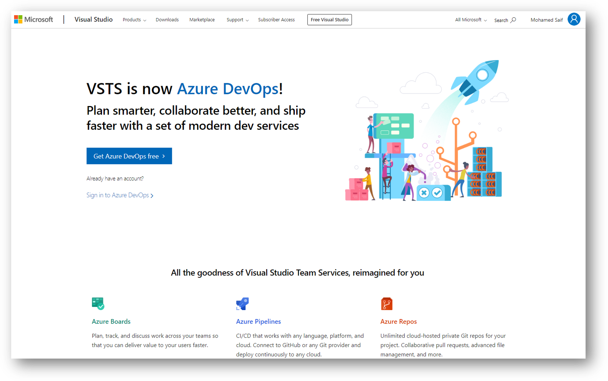
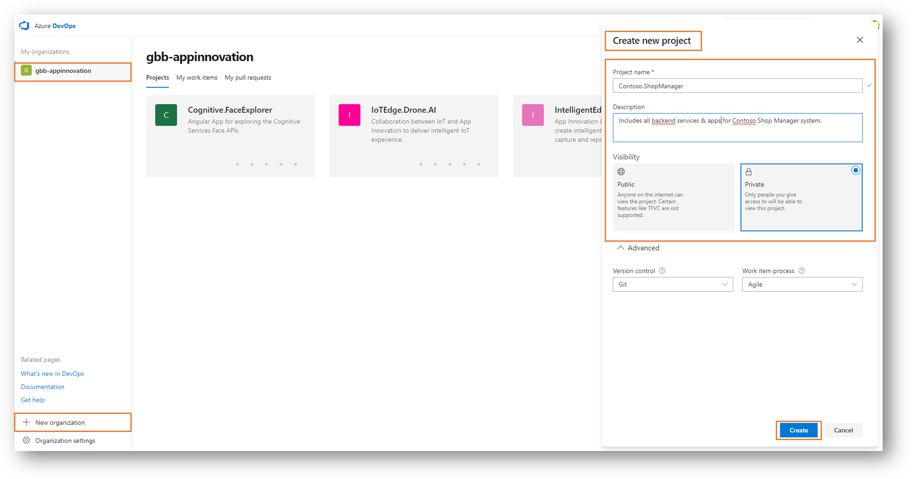
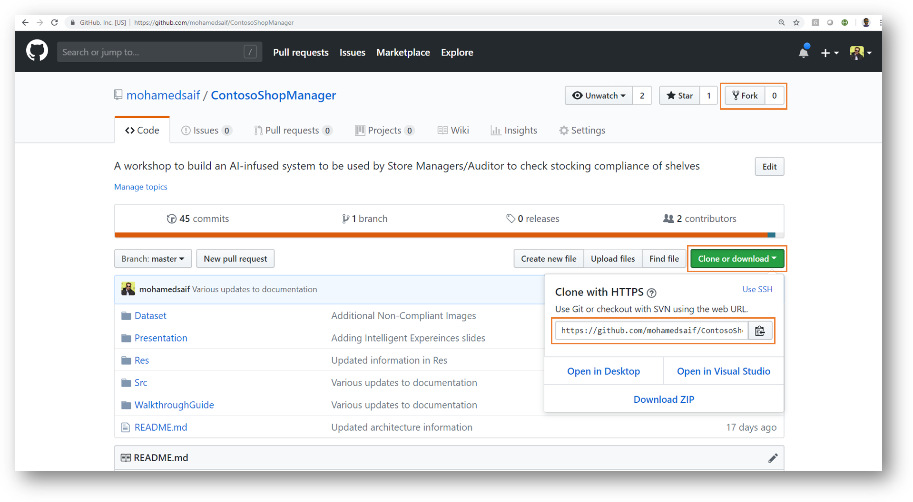

# Contoso Shop Manager Backend

As per the [architecture options discussed](../02-ArchitectureOptions), Contoso Shop Manager system consist of several components as shown in the below reference:

In this walkthrough we will start provisioning all services that were not provisioned as part of the AI services that are provisioned in the previous steps.

To have a quick overview, we will be provisioning the following services:

***Cognitive Services***

1. Computer Vision Service for OCR
2. Computer Vision Service for Face
3. Custom Vision Service

***Storage Services***

1. Azure Storage
2. CosmosDB

***App Services***

1. App Service
2. Function App
3. API Management

***Operations & Security***

1. Azure DevOps
2. App Center
3. App Insights
4. Azure Key Vault
5. Azure ADB2C

## Cognitive Services

Please refer back to the previous guided steps to provision and setup the needed AI services.

1. [Cognitive Services - OCR](../03-CognitiveServices-OCR)
2. [Cognitive Services - Face](../04-CognitiveServices-Face)
3. [Cognitive Services - Customer Vision](../05-CognitiveServices-CustomVision)

## Storage Services

Contoso Shop Manager will be using [Azure Storage](https://docs.microsoft.com/en-us/azure/storage/) to store images and for queue triggers to the cognitive pipeline asynchronous requests. Also storage is used by Azure Functions runtime to persist state and settings.

The system also leverage no-sql data store [ComsoDB](https://docs.microsoft.com/en-us/azure/cosmos-db/introduction) to store all information related to system operations and documents processing.

### Azure Storage

Azure Storage is a Microsoft-managed service providing cloud storage that is highly available, secure, durable, scalable, and redundant. Azure Storage includes Azure Blobs (objects), Azure Data Lake Storage Gen2, Azure Files, Azure Queues, and Azure Tables.

Head to [portal.azure.com](https://portal.azure.com) to start provision a new storage account.

If you didn't already done so, create a ***Resource Group*** to be used to provision all services related to this workshop for easy management.

#### Provisioning

Next you can click on ***Create a resource*** and search for [Storage Account]. Fill in the information needed take into consideration that storage account name must be unique across Azure with all small letters (no special characters allowed).

#### Configuration

Azure Storage required blobs will be created by the Contoso APIs up on initializing it for the first time as you will see later. All just what we need for now to take note of the ***Storage Connection String*** that will be updated in the settings for Azure Functions and App Service.

>***NOTE:*** for more information about the different storage capabilities and options, you can review [Azure Storage Documentation](https://docs.microsoft.com/en-us/azure/storage/).

#### Azure Storage Explorer

A good way to manage your storage accounts (and more) is using the cross platform [Azure Storage Explorer](https://azure.microsoft.com/en-us/features/storage-explorer/).

Through this tool you can easily manage the contents of your storage account. Upload, download, and manage blobs, files, queues, tables, and Cosmos DB entities. Gain easy access to manage your virtual machine disks. Work with either Azure Resource Manager or classic storage accounts, plus manage and configure cross-origin resource sharing (CORS) rules.

### Cosmos DB

Azure Cosmos DB is Microsoft's globally distributed, multi-model database. With the click of a button, Azure Cosmos DB enables you to elastically and independently scale throughput and storage across any number of Azure's geographic regions. It offers throughput, latency, availability, and consistency guarantees with comprehensive service level agreements (SLAs), something no other database service can offer.

Although Cosmos DB has multiple data models and popular APIs for accessing and querying data (like SQL API, MongoDB API, Cassandara API, Gremilin API,...), we will be using SQL API, a schema-less JSON database engine with rich SQL querying capabilities.

#### Provisioning

#### Configuration

Collections in the Cosmos DB will be created automatically by the Contoso APIs app and will be populated by sample documents.

Please take note of ***Connection String*** that will be used later in configuration access to both API and Function services later.

>***NOTE:*** for more information about the different Comoso DB capabilities and options, you can review [Cosmos DB Documentation](https://docs.microsoft.com/en-us/azure/cosmos-db/introduction).

## App Services

Azure has many PaaS offerings that make building cloud native backend an easy task which will free you to focus more on the actual value rather than on the infrastructure.

### Web App

[Azure Web Apps](https://docs.microsoft.com/en-us/azure/app-service/) enables you to build and host web applications in the programming language of your choice without managing infrastructure. It offers auto-scaling and high availability, supports both Windows and Linux, and enables automated deployments from GitHub, Azure DevOps, or any Git repo.

>***NOTE:** C# was selected to be the language used in developing Contoso Shop Manager backend (C# Functions, ASP .NET Core APIs). All discussed services below support several other languages as well (like JavaScript for example).

#### Provisioning

Click ***Create a resource*** to add a new Web App:

#### Configuration

After successful provisioning of the web app, you will see you have access to URL and various settings of your web app.

It is time to push Contoso Shop Manager code to the new web app. You can use FTP, Visual Studio Code Web Deploy or Visual Studio Publish among other options to directly push code, but is highly recommended to push code via an established DevOps CI/CD pipelines.

For simplicity, we will be using [Deployment Center](https://docs.microsoft.com/en-us/azure/app-service/app-service-continuous-deployment) service along with [Azure DevOps](https://visualstudio.microsoft.com/team-services/) (previously known as Visual Studio Team Services VSTS).

Sign in/up to [Azure DevOps](https://visualstudio.microsoft.com/team-services/) to create a new project to host your backend code alogn with pipelines to automate the build and release process:

After setting up your Azure DevOps account, you will be able to create new projects, so click ***Create new project*** to start:

After the project is created, select ***Repos*** to import the code from GitHub.

>***NOTE:*** You can fork the GitHub repo to your GitHub account and then import it to your Azure DevOps repos. Also you can leave your code in GitHub and use Azure DevOps Pipelines for build and release of that code.
